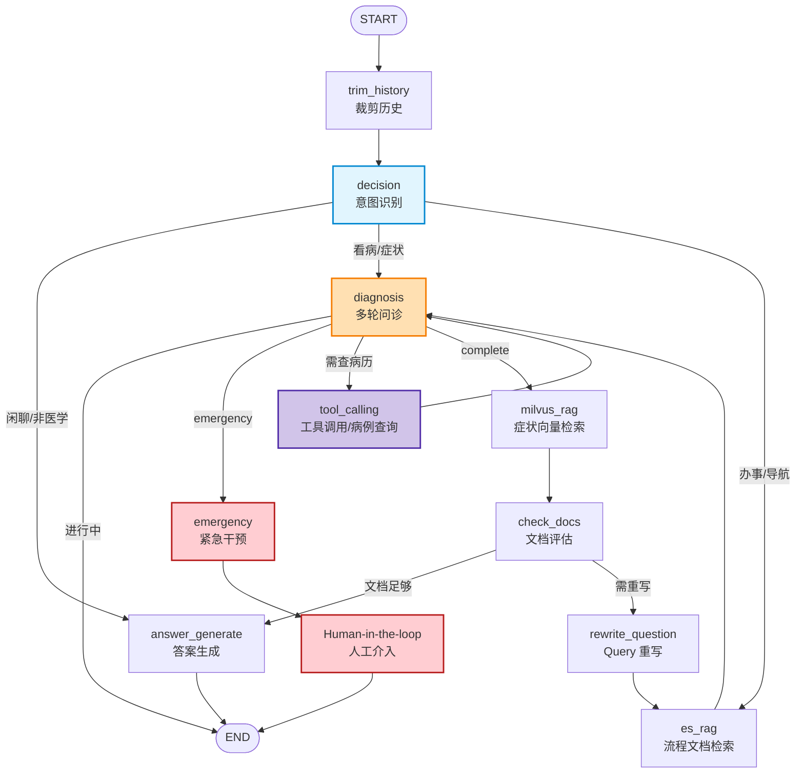

# 生产级医院导诊 Agentic 助手

基于 FastAPI + LangGraph + Redis + Elasticsearch + Milvus + DashScope 的医院导诊问答与流程指引助手，同时提供命令行前端（rich CLI），可以作为生产级医疗导诊 / 医疗流程问答系统的参考实现。

后端通过 LangGraph 状态机编排多轮对话、症状问诊、流程检索与意图识别，前端则以 CLI 形式演示多会话聊天体验（类似 ChatGPT 的会话列表）。

---
web页面：


后端cli-debug：


## 功能特性

- 医疗导诊对话
  - 支持面向「症状问诊」和「就医流程」的多轮对话。
  - **多轮问诊系统**：通过槽位填充逐步收集患者症状信息，输出结构化问诊表。
  - **四层症状提取架构**：
    - Layer 1: 症状词典 (317个keywords快速匹配)
    - Layer 2: LLM抽取 (Qwen Turbo语义提取)
    - Layer 3: 合并到Slot (整合多源结果)
    - Layer 4: 知识图谱校验 (验证+扩展+消歧)
  - **危险信号检测**：实时检测胸痛、呼吸困难等危急症状，立即告警建议挂急诊。
  - 结合向量检索与流程文档检索，给出答案和建议。
- 知识图谱增强
  - **Neo4j图数据库**：存储症状-科室映射、伴随症状、疾病关系
  - **向量搜索**：症状语义匹配 (text-embedding-v2)
  - **两阶段检索**：向量搜索 + 图推理 (多跳查询)
  - **判别性症状**：动态生成追问问题，帮助区分不同科室
- Agentic 对话编排（LangGraph）
  - 使用 `AppState` 管理对话状态，基于 LangGraph 构建状态机。
  - **多Agent协作**：6个专业化Agent节点（意图识别、槽位填充、语义对齐、风险评估、追问生成、结束判断）。
  - 包含意图识别、RAG 检索、文档评估、Query 重写、答案生成等节点。
- 多会话管理（类似 ChatGPT）
  - 会话列表、创建会话、删除会话、切换当前会话。
  - 会话与用户元数据（名称、创建时间、最近活跃时间）存储在 Redis。
- 检索增强生成（RAG）
  - Elasticsearch：医院流程 / 制度等结构化文档检索（hospital_procedures 索引）。
  - Milvus：症状 / 医疗知识向量检索（medical_knowledge 集合）。
  - **混合检索增强**（milvus_rag 节点）：
    - 双路检索：ES (rag_es) + Milvus (medical_knowledge)
    - RRF (Reciprocal Rank Fusion) 融合排序
    - LLM (qwen-turbo) Rerank 精排
  - DashScope Embedding + Chat 模型。
- 命令行前端（rich CLI）
  - `cli.py` 提供交互式 CLI，支持斜杠命令和 Markdown 渲染。
  - 通过 REST API 与后端通信，可作为 Web 前端的参考。

---


### 多轮问诊流程（diagnosis 节点内部）

```
┌─────────────────────────────────────────────────────────────────────────────┐
│                        diagnosis 节点内部流程                                  │
├─────────────────────────────────────────────────────────────────────────────┤
│                                                                             │
│   用户输入: "我胃里翻江倒海，还有点发烧"                                      │
│          │                                                                  │
│          ▼                                                                  │
│   ┌─────────────────────┐                                                   │
│   │  Layer 1: 词典匹配  │                                                   │
│   │  基于317个keywords  │  "翻江倒海" → 无匹配                              │
│   │  快速匹配通俗词汇   │  "发烧" → "发热"                                  │
│   └────────┬────────────┘                                                   │
│            │                                                                  │
│            ▼                                                                  │
│   ┌─────────────────────┐                                                   │
│   │  Layer 2: LLM抽取   │                                                   │
│   │  Qwen Turbo语义理解  │  "翻江翻海" → 胃痛 → "腹痛"                     │
│   │  症状标准化         │  输出: {symptoms: ["腹痛","发热"], ...}          │
│   └────────┬────────────┘                                                   │
│            │                                                                  │
│            ▼                                                                  │
│   ┌─────────────────────┐                                                   │
│   │  Layer 3: 合并Slot  │                                                   │
│   │  词典+LLM合并去重   │  合并: ["腹痛", "发热"]                          │
│   └────────┬────────────┘                                                   │
│            │                                                                  │
│            ▼                                                                  │
│   ┌─────────────────────┐                                                   │
│   │  Layer 4: KG校验    │ ← 新增                                             │
│   │  验证+扩展+消歧     │  验证: ["腹痛","发热"] ✓                          │
│   │  Neo4j图推理       │  扩展: ["恶心","腹胀","腹泻","呕吐",...]          │
│   └────────┬────────────┘                                                   │
│            │                                                                  │
│            ▼                                                                  │
│   ┌─────────────────────┐                                                   │
│   │  risk_check         │                                                   │
│   │  危险信号检测       │   - 检测: 胸痛/呼吸困难/呕血等                      │
│   └────────┬────────────┘                                                   │
│            │                                                                  │
│     ┌──────┴──────┐                                                         │
│     ▼             ▼                                                         │
│  危险信号      无风险                                                        │
│     │             │                                                         │
│     ▼             ▼                                                         │
│  急诊告警    ┌─────────────────┐                                           │
│              │  completion     │                                            │
│              │  判断是否完成   │                                            │
│              └────────┬────────┘                                            │
│                       │                                                      │
│              ┌────────┴────────┐                                             │
│              ▼                ▼                                             │
│         完成            进行中                                                │
│              │                │                                             │
│              ▼                ▼                                             │
│       ┌──────────┐    ┌─────────────────┐                                 │
│       │  输出   │    │  question_gen   │                                 │
│       │  JSON   │    │  生成下一问题   │                                 │
│       │  问诊表 │    │  结合KG扩展症状 │                                 │
│       └──────────┘    └─────────────────┘                                 │
│                                                                             │
└─────────────────────────────────────────────────────────────────────────────┘
```
┌─────────────────────────────────────────────────────────────────────────────┐
│                        diagnosis 节点内部流程                                  │
├─────────────────────────────────────────────────────────────────────────────┤
│                                                                             │
│   用户输入: "我肚子疼"                                                       │
│          │                                                                  │
│          ▼                                                                  │
│   ┌─────────────────┐                                                       │
│   │  normalize     │ ← Agent 1: 语义对齐 (先标准化)                         │
│   │  口语→医学术语  │   - "肚子疼" → "腹痛"                                │
│   │  "我肚子疼"    │   - "我肚子疼" → "我腹痛"                            │
│   └────────┬────────┘                                                       │
│            │                                                                  │
│            ▼                                                                  │
│   ┌─────────────────┐                                                       │
│   │  slot_fill     │ ← Agent 2: 槽位填充                                    │
│   │  提取主诉/症状  │   - chief_complaint: "我腹痛"                        │
│   └────────┬────────┘   - symptoms: ["腹痛"]                                 │
│            │            - location: "腹部"                                   │
│            ▼                                                                  │
│   ┌─────────────────┐                                                       │
│   │ knowledge_graph│ ← Agent 2.5: 知识图谱                                  │
│   │   (新增)       │   - 查询"腹痛"的伴随症状: ["恶心","腹胀","腹泻"]       │
│   │   (症状关联)   │   - 推荐科室: ["消化内科"]                            │
│   └────────┬────────┘                                                       │
│            │                                                                  │
│            ▼                                                                  │
│   ┌─────────────────┐                                                       │
│   │  risk_check    │ ← Agent 3: 风险评估                                    │
│   │  危险信号检测   │   - 检测: 胸痛/呼吸困难/呕血等                        │
│   └────────┬────────┘                                                       │
│            │                                                                  │
│     ┌──────┴──────┐                                                         │
│     ▼             ▼                                                         │
│  危险信号      无风险                                                        │
│     │             │                                                         │
│     ▼             ▼                                                         │
│  急诊告警    ┌─────────────────┐                                           │
│              │  completion    │ ← Agent 5: 结束判断                          │
│              │  判断是否完成   │   - 槽位已满?                               │
│              └────────┬────────┘   - 用户结束?                                │
│                       │         - 轮询上限?                                   │
│              ┌────────┴────────┐                                              │
│              ▼                ▼                                              │
│         完成            进行中                                               │
│              │                │                                               │
│              ▼                ▼                                               │
│       ┌──────────┐    ┌─────────────────┐                                   │
│       │  输出    │    │  question_gen  │ ← Agent 4: 追问生成 (改进)         │
│       │  JSON    │    │  生成下一问题   │   - 结合知识图谱: "有恶心或腹胀吗？"│
│       │  问诊表  │    │  (结合伴随症状) │   - 传统: "这个症状持续多久了？"  │
│       └──────────┘    └─────────────────┘                                   │
│                                                                             │
└─────────────────────────────────────────────────────────────────────────────┘
```

### 多轮问诊示例

| 轮次 | 用户输入 | 系统回复 | 填入槽位 |
|------|---------|---------|---------|
| 1 | 我肚子疼 → normalize → 我腹痛 | 有没有恶心或腹胀等症状？ | chief_complaint: "我腹痛", symptoms: ["腹痛"], location: "腹部", accompanying_symptoms: ["恶心"] |
| 2 | 疼了3天了 | 疼痛程度如何？0-10分？ | duration |
| 3 | 大概7分疼 | 有没有什么情况下会加重或缓解？ | severity |
| 4 | 吃完饭更疼 | 以前有过类似症状吗？ | triggers |
| 5 | 还发烧，恶心 | 问诊完成，推荐消化内科 | accompaning_symptoms: ["发烧", "恶心"], medical_history |

**输出 JSON 问诊表**：
```json
{
  "chief_complaint": "我肚子疼",
  "symptoms": ["腹痛"],
  "duration": "3天",
  "severity": "6-7",
  "location": "腹部",
  "triggers": ["进食"],
  "accompanying_symptoms": ["发热", "恶心"],
  "medical_history": ["无"],
  "risk_signals": []
}
```

---
## 三、LangGraph 节点流

核心对话工作流由 `app/graph` + `app/domain` + `app/services` 实现，以 LangGraph 状态机为中心：



> **说明**：「进行中」表示问诊未完成，本轮结束返回用户下一轮输入。LangGraph 会从 Redis 恢复槽位状态，DECISION 重新进入 DIAGNOSIS 继续追问。

## 项目结构

```
app/
  main.py                  # FastAPI 应用入口（create_app / healthz）
  api/
    routers/
      chat.py              # /chat 对话接口
      threads.py           # /threads 会话管理接口
      users.py             # /users 用户信息接口
  core/
    config.py              # 环境变量 & 配置集中管理
    logging.py             # 日志配置
    llm.py                 # DashScope 兼容 OpenAI 的 Chat / Embedding 封装
  domain/
    models.py              # AppState、IntentResult、RetrievedDoc 等领域模型
    routing.py             # LangGraph 节点路由决策
    diagnosis/             # 多轮问诊系统（四层架构）
      slots.py             # 槽位定义（新增uncertain/expanded字段）
      risk.py              # 危险信号检测
      questions.py         # 追问模板
      filler.py            # 槽位填充逻辑（四层整合）
      symptom_dict.py      # ★新增★ Layer 1: 症状词典 (317 keywords)
      llm_extractor.py    # ★新增★ Layer 2: LLM症状抽取
      kg_validator.py      # ★新增★ Layer 4: 知识图谱校验
  graph/
    builder.py             # LangGraph 状态机构建与编译
    nodes/                 # 各种节点
      decision.py          # 意图识别
      normalize.py         # 语义对齐
      es_rag.py           # 流程文档检索（ES）
      milvus_rag.py        # 症状向量检索（Milvus）
      check_docs.py        # 检索结果评估
      rewrite.py           # Query 重写
      answer.py            # 答案生成
      trim_history.py      # 历史裁剪
      diagnosis.py         # 主编排器
      slot_fill.py         # 槽位填充
      knowledge_graph.py   # 知识图谱工具
      risk_check.py        # 风险评估
      question_gen.py      # 追问生成（利用KG判别性症状）
      completion.py        # 结束判断
  infra/
    redis_client.py        # Redis 连接 & LangGraph RedisSaver
    es_client.py           # Elasticsearch 客户端封装
    milvus_client.py       # Milvus 客户端封装
    neo4j_client.py       # ★新增★ Neo4j 客户端 (向量搜索+图推理)
  tools/
    patient_tools.py       # 病例查询工具
    knowledge_graph_tool.py # 知识图谱工具 (混合检索)
  sessions/
    manager.py             # 会话管理：user_id / thread_id 元数据
  services/
    chat_service.py        # ChatService：衔接 API 与 LangGraph
```

---

## 核心架构概览

- 接口层（`app/api`）
  - `POST /chat`：单轮对话入口，输入 `user_id` / `thread_id` / `message`，返回回复文本、意图识别结果、参考文档等。
  - `GET /threads` / `POST /threads` / `DELETE /threads/{id}` / `GET /threads/current` / `POST /threads/switch`：多会话管理。
  - `POST /users` / `GET /users/{user_id}`：用户元数据管理。
  - `GET /healthz`：健康检查。
- 服务层（`app/services`）
  - `chat_service.chat_once`：封装一次对话请求，负责准备 LangGraph 输入、调用状态机、抽取回复。
- 领域层（`app/domain`）
  - `AppState`：对话状态（消息、意图、检索文档、重写次数等）。
  - `IntentResult` / `RetrievedDoc` / `RelevanceResult` 等领域模型。
  - `routing.py`：根据意图与检索结果决定状态机下一跳。
- 图编排层（`app/graph`）
  - `builder.py`：使用 LangGraph `StateGraph` 定义状态机节点和边。
  - `nodes/*`：
    - `decision.py`：意图识别（症状 / 流程 / 混合 / 非医疗）。
    - `es_rag.py`：流程文档检索（Elasticsearch）。
    - `milvus_rag.py`：症状向量检索（Milvus）+ 双路混合检索（ES rag_es + Milvus medical_knowledge）+ RRF 融合 + LLM Rerank 精排。
    - `check_docs.py`：检索结果评估，决定是否需要重写 Query。
    - `rewrite.py`：问题重写，控制重写次数避免死循环。
    - `answer.py`：综合上下文与文档生成最终答案。
    - `trim_history.py`：根据阈值裁剪对话历史。
- 基础设施层（`app/infra`）
  - Redis：会话状态 & LangGraph Checkpoint & 用户/会话元数据。
  - Elasticsearch：流程/制度类文档检索。
  - Milvus：医疗知识 / 症状库向量检索。
  - Neo4j：症状知识图谱（图数据库）+ 向量索引（语义匹配）。
  - DashScope：Chat & Embedding 模型。
- 会话管理（`app/sessions`）
  - 基于 Redis 管理 `user_id` / `thread_id` 关系、会话标题、创建时间、最近活跃时间、删除标记等。

更多细节可以参考 `项目总结.md` 中的架构图与说明。

---

## 环境依赖

- Python 3.10+
- Redis
- Elasticsearch
- Milvus（或兼容协议的向量库）
- Neo4j 5.x（图数据库 + 向量索引支持）
- DashScope 账号与 API Key（兼容 OpenAI API）

主要 Python 依赖（摘要）：

- `fastapi`
- `uvicorn`
- `langgraph`
- `langchain-core`
- `langchain-openai`
- `redis`
- `pymilvus`
- `elasticsearch`
- `python-dotenv`
- `rich`
- `requests`

（具体依赖请根据实际 `pyproject.toml` / `requirements.txt` 或本地环境为准。）

---

## 配置与环境变量

核心环境变量集中在 `app/core/config.py` 中，项目会通过 `python-dotenv` 自动加载 `.env` 文件。

必填：

- `DASHSCOPE_API_KEY`：DashScope 兼容 OpenAI API 的密钥。

可选（带默认值）：

- `ES_URL`：Elasticsearch 地址，默认 `http://localhost:9200`。
- `MILVUS_URI`：Milvus 地址，默认 `http://localhost:19530`。
- `REDIS_URI`：Redis 地址，默认 `redis://localhost:6379`。
- `ES_INDEX_NAME`：流程文档索引名，默认 `hospital_procedures`。
- `MILVUS_COLLECTION`：Milvus 集合名，默认 `medical_knowledge`。
- `MILVUS_TOP_K` / `MILVUS_MIN_SIM` / `MILVUS_MAX_DOCS`：Milvus 检索参数。
- `RETRIEVAL_K`：双路检索时每路取 top_k，默认 50。
- `RRF_K`：RRF 融合参数，默认 60。
- `RERANK_TOP_N`：Rerank 精排后返回数量，默认 10。
- `MAX_REWRITE`：允许的最大 Query 重写次数。
- `MAX_HISTORY_MSGS` / `TRIM_TRIGGER_MSGS`：会话历史裁剪控制。
- `CHAT_MODEL_NAME`：聊天模型名，默认 `qwen3-max`。
- `EMBEDDING_MODEL_NAME`：向量模型名，默认 `text-embedding-v2`。
- `CHAT_BASE_URL` / `EMBEDDING_BASE_URL`：DashScope 兼容 OpenAI 接口地址。
- `LLM_TIMEOUT` / `LLM_MAX_RETRIES` / `LLM_TEMPERATURE`：LLM 请求配置。

CLI 相关：

- `BACKEND_BASE_URL`：CLI 连接的后端地址，默认 `http://localhost:8000`。
- `BACKEND_TIMEOUT`：CLI 请求超时时间（秒），默认 `120`。

多轮问诊相关 ★新增★：

- `DIAGNOSIS_MAX_QUESTIONS`：最大追问轮数，默认 `10`。
- `DIAGNOSIS_SESSION_TTL`：问诊状态缓存时间（秒），默认 `3600`。

---

## 本地开发与运行（含 RAG 入库）

### 0. 前置准备
- Python 3.10+
- Docker / Docker Compose（用于 Redis + Elasticsearch + Milvus）
- `.env` 中设置 `DASHSCOPE_API_KEY`

### 1. 启动基础设施
```bash
# Redis（含 RedisJSON/RedisSearch）
cd demo/redis
docker compose up -d

# Elasticsearch + Milvus（单机，内置 Etcd/MinIO）
cd ../es_milvus_DB
docker compose up -d

# Neo4j 5.x（图数据库 + 向量索引）
cd ../neo4j
docker run -d --name neo4j -p 7474:7474 -p 7687:7687 -e NEO4J_AUTH=neo4j/password neo4j
```

### 2. 安装依赖
```bash
pip install -r requirements.txt
```

（如仅跑入库脚本，可按需安装 `elasticsearch`、`langchain-milvus`、`pymilvus`、`langchain-openai`、`python-dotenv`。）

### 3. RAG 数据入库
- ES 索引说明：
  - `hospital_procedures`：医院流程/制度文档（用于 es_rag 流程检索）
  - `rag_es`：医疗问答数据（用于 milvus_rag 混合检索）
- ES（流程/制度文档）：
  ```bash
  cd demo
  # 数据：demo/data/es医院导诊指南_clean.json
  pip install elasticsearch python-dotenv
  python es.py   # 索引为空时自动创建 hospital_procedures 并写入
  ```
  如需调整 ES 地址/索引/数据文件，修改 `demo/es.py` 顶部的 `ES_URL`、`INDEX_NAME`、`DATA_PATH`。

- ES（医疗问答，用于混合检索）：
  ```bash
  cd demo
  # 数据：demo/data/milvus数据Add.txt（JSONL格式）
  python milvus_es_import.py   # 同时导入 ES rag_es 索引 + Milvus collection
  ```

- Milvus（症状问诊向量库）：
  ```bash
  cd demo
  # 数据：demo/data/milvus数据.txt（id/raw_question/safe_answer/departments/tags/source）
  pip install langchain-openai langchain-milvus pymilvus python-dotenv
  export DASHSCOPE_API_KEY=your_key
  python milvus.py   # 增量入库，仅写入新增业务 id
  ```
  如需调整 Milvus 地址/集合/索引参数，修改脚本顶部 `MILVUS_URI`、`MILVUS_COLLECTION`、`DATA_PATH`。

> 数据清洗：原始问答需先用 LLM 改写成安全回答 `safe_answer`、推荐科室 `departments`、症状标签 `tags`（见 `demo/项目设计.md`），再执行入库脚本。

- Neo4j 知识图谱（症状-科室映射）：
  ```bash
  # 数据位置：data/knowledge_graph/
  # - symptoms.json: 100个症状（含317个keywords）
  # - departments.json: 50个科室
  # - relations/: 症状-科室映射、伴随症状关系、疾病关系

  # 导入数据到 Neo4j：
  cd data/knowledge_graph
  python import_to_neo4j.py

  # 构建向量索引（用于语义匹配）：
  python build_symptom_vector_index.py
  ```

### 4. 启动后端服务
```bash
uvicorn app.main:app --reload
```
生产环境可使用多 worker 模式：
```bash
uvicorn app.main:app --workers 4 --host 0.0.0.0 --port 8000
```

### 5. 运行 CLI 前端
```bash
python cli.py
```
CLI 会完成健康检查、用户初始化和当前会话获取，普通文本发送到 `/chat`，斜杠命令用于管理会话/用户。

常用命令：`/help`、`/threads`、`/new`、`/switch`、`/delete`、`/user`、`/exit`。

可通过环境变量覆盖 CLI 连接信息：
```bash
export BACKEND_BASE_URL=http://localhost:8000
export BACKEND_TIMEOUT=120
python cli.py
```

### 6. 运行 Web 前端（interview-demo）
```bash
cd interview-demo
npm install
npm run dev
```
访问显示的本地地址（通常是 `http://localhost:5173`）即可使用 Web 界面。

---

## API 简要说明

仅列出核心接口，详细字段可通过代码或自动文档（FastAPI Swagger）查看。

- `POST /chat`
  - 请求体：`{ user_id: string, thread_id?: string, message: string, password_verified?: boolean }`
  - 响应体（简化）：  
    - `user_id`: 用户 ID  
    - `thread_id`: 当前会话 ID  
    - `reply`: 助手回复文本（Markdown）  
    - `intent_result`: 意图识别结果（是否为症状/流程/混合等）  
    - `used_docs.medical` / `used_docs.process`: 本轮使用到的文档列表
    - `diagnosis`: 多轮问诊信息 ★新增★
      - `type`: 问诊阶段（in_progress / complete / emergency）
      - `completed`: 是否完成
      - `slots`: 已填充的槽位（JSON 问诊表）
      - `risk_signals`: 检测到的危险信号
      - `risk_level`: 风险等级（none / warning / critical）

- `GET /threads?user_id=...`
- `POST /threads`
- `DELETE /threads/{thread_id}?user_id=...`
- `GET /threads/current?user_id=...`
- `POST /threads/switch`

- `POST /users`
- `GET /users/{user_id}`

- `GET /healthz`

---

## 适用场景与扩展方向

- 医院导诊 / 分诊问答机器人。
- 医院内部流程、制度、规则的问答助手。
- 其他垂直领域（如保险、政务）的 Agentic RAG 助手参考实现。

可以进一步扩展的方向：

- 替换/增加更多 LLM 提供商或模型。
- 增加工具调用节点（如挂号、检查预约、费用查询）。
- 接入 Web 前端或小程序前端。
- 增强监控与日志分析，接入 APM / tracing。

---
## 说明

本项目主要用于展示「生产级医院导诊 Agentic 助手」的整体设计与实现思路，涉及的医学内容仅为技术演示示例，不构成任何医疗建议或诊断依据，请勿用于真实诊疗决策。
## 本项目与企业配置对比

| 系统模块 | 本项目方案（DashScope云端） | 企业推荐组合（国产私有化） | 推理设备 | 推荐GPU配置 |
| -------- | --------------------------- | -------------------------- | -------- | ------------ |
| 意图识别 | qwen-turbo | Qwen2-3B-Instruct / ERNIE-4.0-8K | CPU | 无需GPU |
| 槽位抽取 | 规则匹配(filler.py) | Qwen2-3B-Instruct / ERNIE-Med | CPU | 无需GPU |
| Query Rewrite | qwen-turbo | Qwen2-3B-Instruct | CPU | 无需GPU |
| 文档相关性检查 | qwen-turbo | Qwen2-3B-Instruct | CPU | 无需GPU |
| 工具调用 | qwen-turbo | Qwen2-3B-Instruct | CPU | 无需GPU |
| Embedding向量 | text-embedding-v2 (1536维) | **BGE-m3** (智源) / Jina-embeddings-v2 | CPU | 无需GPU |
| 向量检索 | Milvus | Milvus / Milvus Cluster | CPU | 无需GPU |
| Rerank精排 | qwen-turbo | **BGE-reranker-v2-m3** (智源) / Qwen2-7B-Instruct | GPU | RTX 4080 |
| RAG答案生成 | **qwen3-max** | Qwen2.5-72B-Instruct / ERNIE-4.0-8K | GPU | A100 80G |
| 会话记忆 | Redis | Redis / PostgreSQL | CPU | 无需GPU |

### 详细企业模型推荐

| 用途 | 推荐模型 | 厂商 | 参数量 | 量化版本 |
| ---- | -------- | ---- | ------ | -------- |
| **最终回答** | Qwen2.5-72B-Instruct | 阿里云 | 72B | Q4_K_M |
| **最终回答(备选)** | ERNIE-4.0-8K | 百度 | - | - |
| **Rerank** | BGE-reranker-v2-m3 | 智源 | - | FP16 |
| **Rerank(备选)** | Qwen2-7B-Instruct | 阿里云 | 7B | Q4_K_M |
| **轻量任务** | Qwen2-3B-Instruct | 阿里云 | 3B | Q4_K_M |
| **Embedding** | BGE-m3 | 智源 | - | FP16 |
| **Embedding(备选)** | Jina-embeddings-v2-base-zh | Jina | - | FP16 |

### 企业硬件配置建议

| 方案 | 定位 | CPU | GPU | 内存 | 存储 | 预估并发 |
| ---- | ---- | ---- | ---- | ---- | ---- | -------- |
| 入门版 | 50用户内 | Intel Xeon Gold 6430 (32核) | RTX 4080 | 64GB | 2TB NVMe | 50 |
| 标准版 | 200用户内 | Intel Xeon Gold 6448Y (64核) | A100 40GB | 128GB | 4TB NVMe | 200 |
| 集群版 | 500+用户 | AMD EPYC 9554 (256核) | A100 80GB x4 | 512GB | 8TB NVMe | 500+ |

