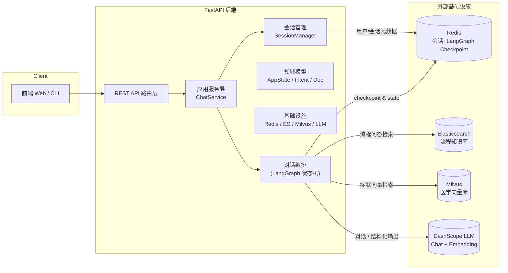
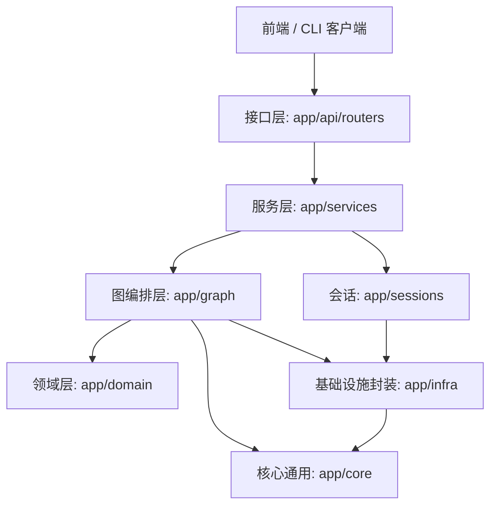
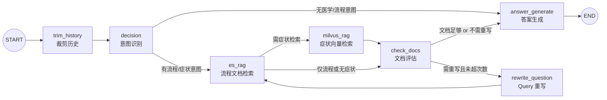

# 医院导诊 Agentic 助手后端项目总结

> 说明：本总结只覆盖后端部分（FastAPI + LangGraph + Redis + ES + Milvus），前端暂不展开。

---

## 一、整体架构图



---

## 二、组件架构图（分层视角）



---

## 三、后端核心架构图（LangGraph 节点流）

核心对话工作流由 `app/graph` + `app/domain` + `app/services` 实现，以 LangGraph 状态机为中心：



- 节点定义集中在 `app/graph/nodes/*`。
- 路由逻辑集中在 `app/domain/routing.py`。
- 图的构建与编译在 `app/graph/builder.py`，通过 Redis Checkpoint 将 `AppState` 持久化，实现有状态对话。

---

## 四、目录结构概览（后端相关）

项目后端主要目录：

```text
app/
  main.py                  # FastAPI 应用入口（create_app）
  api/
    routers/
      chat.py              # /chat 对话接口
      threads.py           # /threads 会话管理接口
      users.py             # /users 用户元数据接口
  core/
    config.py              # 配置与环境变量集中管理
    logging.py             # 日志配置
    llm.py                 # ChatOpenAI / Embedding 封装
  domain/
    models.py              # AppState / IntentResult / RetrievedDoc 等领域模型
    routing.py             # LangGraph 节点路由决策
  graph/
    builder.py             # LangGraph 图构建 & compile
    nodes/
      decision.py          # 意图识别
      es_rag.py            # ES 流程检索
      milvus_rag.py        # Milvus 医学检索
      check_docs.py        # 文档相关性评估
      rewrite.py           # Query 重写
      answer.py            # 最终答案生成
      trim_history.py      # 对话历史裁剪
  infra/
    redis_client.py        # Redis 连接 & LangGraph RedisSaver
    es_client.py           # ES 客户端封装
    milvus_client.py       # Milvus 向量检索封装
  sessions/
    manager.py             # 会话线程管理（Redis 上的 user/thread 元数据）
  services/
    chat_service.py        # ChatService：把 API 调用接到 LangGraph

demo.py                    # 早期 demo / CLI 版本，逻辑已拆分进 app/*
frontend/                  # 前端代码（本总结不展开）
.env                       # 本地环境变量示例（仅包含 DASHSCOPE_API_KEY）
```

---

## 五、配置 / 环境变量

集中定义在 `app/core/config.py`，通过 `dotenv.load_dotenv(override=True)` 预加载 `.env`，并提供 `_require_env` 保证关键变量存在：

- 外部服务：
  - `DASHSCOPE_API_KEY`（必填）：DashScope 兼容 OpenAI API 的密钥。
  - `ES_URL`：Elasticsearch 地址，默认 `http://localhost:9200`。
  - `MILVUS_URI`：Milvus 地址，默认 `http://localhost:19530`。
  - `REDIS_URI`：Redis 地址，默认 `redis://localhost:6379`。
- 索引 / 集合：
  - `ES_INDEX_NAME`：流程知识库索引名，默认 `hospital_procedures`。
  - `MILVUS_COLLECTION`：医学向量库集合名，默认 `medical_knowledge`。
- 检索与重写参数：
  - `MILVUS_TOP_K`：Milvus 初始检索 topK，默认 `15`。
  - `MILVUS_MIN_SIM`：Milvus 相似度阈值，默认 `0.5`。
  - `MILVUS_MAX_DOCS`：传给下游的最大文档数，默认 `8`。
  - `MAX_REWRITE`：Query 重写最大次数，默认 `2`。
- 历史控制：
  - `MAX_HISTORY_MSGS`：保留的最近消息数，默认 `12`。
  - `TRIM_TRIGGER_MSGS`：超出该条数才触发裁剪，默认 `24`。
- 模型相关：
  - `CHAT_MODEL_NAME`：对话模型名，默认 `qwen3-max`。
  - `EMBEDDING_MODEL_NAME`：向量模型名，默认 `text-embedding-v2`。
  - `CHAT_BASE_URL` / `EMBEDDING_BASE_URL`：DashScope 兼容 API 地址。
  - `LLM_TIMEOUT` / `LLM_MAX_RETRIES` / `LLM_TEMPERATURE`：调用超时、重试、温度等参数。

LLM 封装：

- `app/core/llm.py::get_chat_llm()`：懒加载 `ChatOpenAI`，使用上述配置。
- `app/core/llm.py::get_embedding_model()`：懒加载 `OpenAIEmbeddings`，用于 Milvus 检索。

---

## 六、核心逻辑代码说明

### 1. FastAPI 应用入口

- 文件：`app/main.py`
- 职责：
  - 创建 `FastAPI` 实例，title 为 `"Medical RAG Assistant"`。
  - 注册路由：`/chat`、`/threads`、`/users`。
  - 提供 `GET /healthz` 健康检查接口。

### 2. 领域模型与状态

- 文件：`app/domain/models.py`
- 关键模型：
  - `IntentResult`：意图识别结果，包含症状/流程意图、查询文本以及是否需要检索的布尔标记。
  - `RetrievedDoc`：检索文档统一视图（ID、source、title、content、score）。
  - `RelevanceResult`：文档是否足以回答、是否需要重写 symptom/process 查询等。
  - `AppState`：LangGraph 全局状态，包括消息列表、意图、医学/流程文档、重写状态等，并带有多个 `field_validator` 以兼容 Redis 中存储的 LC 结构化格式。
  - 同时在模块底部定义了共享常量 `MAX_REWRITE`、`MAX_HISTORY_MSGS`、`TRIM_TRIGGER_MSGS`，供各节点复用。

### 3. LangGraph 图构建与路由

- 文件：`app/graph/builder.py`
  - 使用 `StateGraph(AppState)` 定义图。
  - 注册节点：`decision`、`es_rag`、`milvus_rag`、`check_docs`、`rewrite_question`、`answer_generate`、`trim_history`。
  - 配置边和条件边：
    - `START -> trim_history -> decision`。
    - `decision` 的条件边来源于 `route_after_decision`。
    - `es_rag` 的条件边来源于 `route_after_es`。
    - `check_docs` 的条件边来源于 `route_after_docs`。
  - `build_app(checkpointer)`：对图进行 `compile(checkpointer=RedisSaver)`，返回可调用的 `app` 实例。

- 文件：`app/domain/routing.py`
  - `route_after_decision(state)`：根据 `IntentResult` 是否包含症状/流程意图决定是直接回答还是进入 `es_rag`。
  - `route_after_es(state)`：根据 `need_symptom_search` 决定是否进入 `milvus_rag`。
  - `route_after_docs(state)`：根据 `RelevanceResult` 和 `rewrite_attempts` 决定结束生成或进入 `rewrite_question`。

### 4. 图节点逻辑

- `decision_node`（意图识别）：`app/graph/nodes/decision.py`
  - 通过 `get_chat_llm().with_structured_output(IntentResult)` 调用 LLM，输出结构化 `IntentResult`。
  - 若调用失败，则返回兜底的非医疗意图，避免影响主流程。

- `es_rag_node`（流程类 RAG）：`app/graph/nodes/es_rag.py`
  - 条件：只有当 `has_process` 且 `need_process_search` 且 `process_query` 非空时才触发。
  - 调用 `infra.es_client.search_process_docs` 对流程知识库进行检索。

- `milvus_rag_node`（医学症状 RAG）：`app/graph/nodes/milvus_rag.py`
  - 条件：`has_symptom`、`need_symptom_search` 且 `symptom_query` 非空。
  - 调用 `infra.milvus_client.search_medical_docs` 做向量检索，并带有异常兜底逻辑（Milvus 异常时关闭后续症状检索）。

- `check_docs_node`（文档评估）：`app/graph/nodes/check_docs.py`
  - 将当前检索到的 `medical_docs` 和 `process_docs` 格式化成文本块传给 LLM。
  - 通过结构化输出 `RelevanceResult`，判断是否需要重写 Query 或可以直接回答。

- `rewrite_question`（Query 重写）：`app/graph/nodes/rewrite.py`
  - 当 `need_rewrite_symptom`/`need_rewrite_process` 为 `True` 且重写次数未超过 `MAX_REWRITE` 时，调用 LLM 对 query 改写。
  - 同时调整 `IntentResult` 中的 `need_*_search` 标记以控制后续检索。

- `trim_history_node`（历史裁剪）：`app/graph/nodes/trim_history.py`
  - 当 `messages` 数量超过 `TRIM_TRIGGER_MSGS` 时，仅保留最近 `MAX_HISTORY_MSGS` 条，以控制状态大小与上下文长度。

- `answer_generate_node`（最终回答）：`app/graph/nodes/answer.py`
  - 将对话历史、医学/流程文档以及当前问题拼成统一 Prompt，调用 LLM 生成最终回答。
  - 若生成失败则返回兜底错误提示。

### 5. 服务层与 API 对接

- 文件：`app/services/chat_service.py`
  - 全局 `_app = build_app(checkpointer)`：编译好的 LangGraph 应用。
  - 全局 `_session_manager = SessionManager()`：会话管理实例。
  - `chat_once(user_id, thread_id, message)`：
    - `_ensure_thread`：确保当前用户有一个可用的 `thread_id`（若无则创建默认会话）。
    - 构造输入：`{"messages": [HumanMessage(content=message)]}`。
    - 通过 `_app.invoke(inputs, config={"configurable": {"thread_id", "user_id"}})` 调用 LangGraph，使用 RedisSaver 做 Checkpoint。
    - 从最终 `AppState` 中提取回复消息和文档，序列化为 `ChatResponse` 对应的字典结构。
    - 调用 `_session_manager.touch_thread(thread_id)` 更新会话最近活跃时间。
  - `get_session_manager()`：给路由层复用 `SessionManager`。

---

## 七、后端 API 接口设计

### 1. 对话接口 `/chat`

- 路由文件：`app/api/routers/chat.py`
- 前缀：`/chat`
- 方法：`POST /chat`
- 请求体 `ChatRequest`：
  - `user_id: str`：用户唯一标识。
  - `thread_id: Optional[str]`：会话 ID，如未提供则自动使用/创建当前会话。
  - `message: str`：用户问题。
- 响应体 `ChatResponse`：
  - `user_id: str`
  - `thread_id: str`：当前会话 ID。
  - `reply: str`：生成的回答。
  - `intent_result: Optional[IntentResult]`：结构化意图识别结果（可用于前端调试 / 分析）。
  - `used_docs: { medical: List[RetrievedDoc], process: List[RetrievedDoc] }`：本轮检索到并用于回答的文档，方便前端高亮引用。
- 实现要点：
  - 使用 `asyncio.get_event_loop().run_in_executor` 调用同步的 `chat_service.chat_once`，避免阻塞事件循环。

### 2. 会话管理接口 `/threads`

- 路由文件：`app/api/routers/threads.py`
- 前缀：`/threads`

1）`GET /threads`

- 查询参数：`user_id: str`
- 响应体：`List[ThreadInfo]`
  - `thread_id: str`
  - `title: str`
  - `created_at: str`
  - `last_active_at: str`
  - `is_deleted: bool`
- 功能：按最近活跃时间倒序返回该用户所有未删除会话。

2）`POST /threads`

- 请求体：`CreateThreadRequest`
  - `user_id: str`
  - `title: Optional[str]`
- 响应体：`CreateThreadResponse`
  - `thread_id: str`
  - `title: str`
- 功能：创建新会话，并自动设置为当前会话。

3）`DELETE /threads/{thread_id}`

- 查询参数：`user_id: str`
- 响应体：`DeleteThreadResponse`
  - `deleted: bool`：是否实际删除。
  - `new_current_thread_id: Optional[str]`：如果删除的是当前会话，则返回新的当前会话 ID。

4）`GET /threads/current`

- 查询参数：`user_id: str`
- 响应体：`ThreadInfo`
- 功能：
  - 获取当前用户的“当前会话”。
  - 若不存在则自动创建一个标题为“默认对话”的会话。

5）`POST /threads/switch`

- 请求体：`SwitchThreadRequest`
  - `user_id: str`
  - `thread_id: str`
- 响应体：`SwitchThreadResponse`
  - `thread_id: str`
  - `title: str`
- 功能：设置指定 `thread_id` 为当前会话（要求该会话存在）。

### 3. 用户元数据接口 `/users`

- 路由文件：`app/api/routers/users.py`
- 前缀：`/users`

1）`POST /users`

- 请求体：`UserCreate`
  - `user_id: str`
  - `name: Optional[str]`
- 响应体：`UserInfo`
  - `user_id: str`
  - `name: Optional[str]`
  - `created_at: str`
- 功能：
  - 在 Redis 中创建或更新用户基础信息（`user:{user_id}:meta`）。
  - 若用户已存在则保留原 `created_at`，实现幂等更新。

2）`GET /users/{user_id}`

- 响应体：`UserInfo`
- 功能：从 Redis 读取用户元数据；不存在则返回 404。

### 4. 健康检查接口 `/healthz`

- 路由文件：`app/main.py`
- 方法：`GET /healthz`
- 响应：`{"status": "ok"}`，并记录一个日志，用于存活探针。

---

## 八、Redis 会话管理设计

Redis 在本项目中有两大用途：

1. LangGraph Checkpoint：保存每个 `thread_id` 的 `AppState`，实现**有状态对话**。
2. 会话 & 用户元数据：管理用户-会话关系、会话列表、当前会话等。

### 1. Checkpoint：对话状态持久化

- 文件：`app/infra/redis_client.py`
  - `redis_client = redis.Redis.from_url(config.REDIS_URI, decode_responses=True)`：普通 KV 客户端。
  - `checkpointer = RedisSaver.from_conn_string(config.REDIS_URI)`：LangGraph 的 RedisSaver，用于状态持久化。
  - `checkpointer.setup()`：初始化必要的 Redis 结构。
- 使用方式：`app/services/chat_service.py`
  - `build_app(checkpointer)` 时传入，LangGraph 在每轮对话时会自动根据 `configurable.thread_id` 读写状态，实现**跨轮会话记忆**。

### 2. 会话管理：`SessionManager`

- 文件：`app/sessions/manager.py`
- Redis Key 约定：
  - `user:{user_id}:current_thread`：字符串，当前用户正在使用的 `thread_id`。
  - `user:{user_id}:threads`：有序集合（sorted set），成员为 `thread_id`，score 为最近活跃时间戳，用于会话列表排序。
  - `thread:{thread_id}:meta`：哈希，存储单个会话的元数据：
    - `user_id`
    - `title`
    - `created_at`
    - `last_active_at`
    - `is_deleted`（"0" / "1"）

- 核心方法：
  - `get_current_thread(user_id) -> Optional[str]`
    - 从 `user:{user_id}:current_thread` 获取当前会话 ID。
  - `set_current_thread(user_id, thread_id)`
    - 设置当前会话。
  - `create_thread(user_id, title=None) -> str`
    - 生成 `thread_id = "{user_id}:s:{短UUID}"`。
    - 写入 `thread:{thread_id}:meta` 元数据。
    - 将 `thread_id` 插入 `user:{user_id}:threads` sorted set，并设为当前会话。
  - `touch_thread(thread_id)`
    - 更新对应 `thread:{thread_id}:meta.last_active_at` 为当前时间。
    - 同时更新 `user:{user_id}:threads` 中该线程的 score（最近活跃时间）。
  - `list_threads(user_id) -> list[dict]`
    - 从 `user:{user_id}:threads` 取出所有 `thread_id`（按 score 倒序），逐个读取 `thread:{thread_id}:meta`。
    - 过滤掉 `is_deleted == "1"` 或缺失 meta 的线程。
  - `delete_thread(user_id, thread_id) -> Optional[str]`
    - 将 `thread:{thread_id}:meta.is_deleted` 置为 "1"。
    - 从 `user:{user_id}:threads` sorted set 中移除该线程。
    - 若删除的是当前会话，则尝试将当前会话设为列表中最近活跃的会话；若列表为空则自动创建一个新会话返回其 ID。

- 与 API 的协同：
  - `/chat` 入口通过 `_ensure_thread` 保证每个用户始终有一个可用会话，且在每轮对话后通过 `touch_thread` 刷新活跃时间，确保会话列表按最近使用排序。
  - `/threads` 系列接口直接使用同一个 `SessionManager` 实例，实现 Web 端对会话的创建、切换、删除和查询。

### 3. 用户元数据

- 文件：`app/api/routers/users.py`
- Key 设计：`user:{user_id}:meta`，哈希结构，用于存放：
  - `user_id`
  - `name`
  - `created_at`
- 仅作轻量级元数据存储，不参与 LangGraph 逻辑。

---

## 九、补充：demo.py 与当前架构关系

- `demo.py` 是早期的**单文件 demo / CLI 版本**，集成了：
  - LangGraph 状态机定义
  - ES / Milvus / Redis / LLM 调用
  - 会话管理 CLI（`/new`、`/list`、`/switch`、`/delete` 等）
- 当前正式后端已经将其主要逻辑按职责拆分到：
  - `app/domain/*`：模型与路由
  - `app/graph/*`：节点与图构建
  - `app/infra/*`：外部服务封装
  - `app/sessions/*`：会话管理
  - `app/services/*` + `app/api/*`：服务与 HTTP API 层
- `demo.py` 现在主要可作为本地调试、命令行体验入口的参考实现，不直接参与 FastAPI 服务运行。

---

## 十、小结

- 本后端是一个**基于 LangGraph 的有状态医疗导诊助手**：
  - 使用 `AppState` + Redis Checkpoint 管理多轮对话状态。
  - 通过意图识别将用户问题拆解为“症状问诊”和“流程问答”，分别走 Milvus 向量检索和 ES 流程检索。
  - 使用文档评估 + Query 重写路线保证召回质量，同时通过重写次数上限避免“死循环”。
  - 通过 `SessionManager` 实现类似 ChatGPT 的多会话管理能力（会话列表、删除、当前会话切换）。
- 整体架构清晰地分为：接口层、服务层、领域层、图编排层和基础设施封装层，方便后续扩展更多节点（如工具调用、结构化表单生成）、替换底层检索引擎或 LLM 提供商。

---


